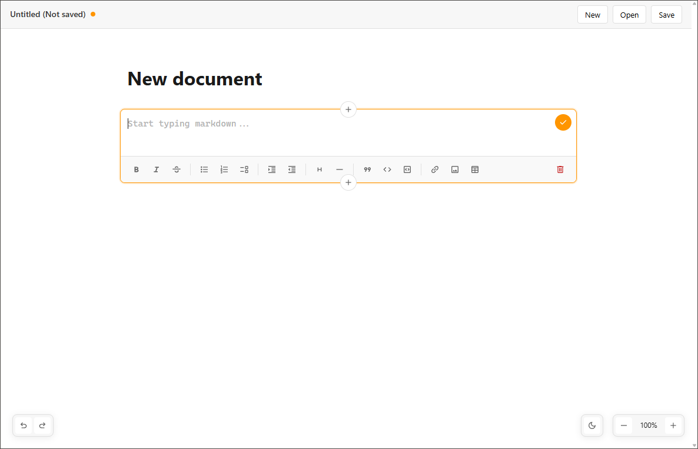

# BlockEdit

_A markdown editor with draggable blocks and a beautiful UI._

  

## Features

- Elegant user interface and accessible user experience. No configuration by design.
- Quickly insert lists, headers, quotes, code blocks, images, tables, and more.
- Blocks are formatted and rendered as soon as you click out of them.
- Drag and drop blocks to reorder them; all changes autosave to disk.
- Undo buffer and autosave, so you never lose your work.
- Keyboard shortcuts for most common actions, such as Undo / Redo, Save, Insert block, Zoom in / Zoom out, etc.
- Configurable zoom levels and built-in dark mode.
